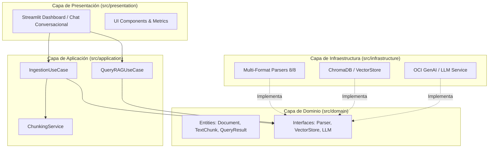

# 🤖 Agent-AI-Oracle: Agente de IA Corporativo (Desafío Alura - OCI)

[](https://www.python.org/)
[](https://www.oracle.com/cloud/)
[](https://streamlit.io/)
[](https://www.docker.com/)
[](#-arquitectura-del-sistema)

> **Desafío Alura Agentes:** Agente de Inteligencia Artificial Empresarial capaz de responder preguntas a cualquier colaborador con base en documentos internos multiformato, desplegado en **Oracle Cloud Infrastructure (OCI)**.

---

## 📌 Tabla de Contenidos
- [🎯 Visión General & Características](#-visión-general--características)
- [📑 Formatos de Documentos Soportados](#-formatos-de-documentos-soportados-88)
- [🏢 Dominios Organizacionales](#-dominios-organizacionales)
- [🏛️ Arquitectura del Sistema](#%EF%B8%8F-arquitectura-del-sistema)
- [📸 Evidencia del Despliegue en OCI](#-evidencia-del-despliegue-en-oci)
- [🚀 Guía de Instalación y Ejecución Local](#-guía-de-instalación-y-ejecución-local)
- [🐳 Despliegue en Oracle Cloud Infrastructure (OCI)](#-despliegue-en-oracle-cloud-infrastructure-oci)
- [🧪 Pruebas Unitarias](#-pruebas-unitarias)

---

## 🎯 Visión General & Características

**Agent-AI-Oracle** funciona como una base de conocimiento conversacional, centralizada y siempre disponible para cualquier colaborador de la organización.

- 🔍 **Búsqueda Semántica RAG:** Retrieval-Augmented Generation con chunking dinámico e indexación de embeddings.
- 📌 **Citación Explícita de Fuentes:** Cada respuesta incluye la fuente documental exacta y su categoría de origen.
- 🛡️ **Guardrails Anti-Alucinaciones:** Respuestas restrictivas al contexto verificado.
- ☁️ **OCI Native:** Preparado para OCI Generative AI Service, OCI Compute y OCI Container Instances.

---

## 📑 Formatos de Documentos Soportados (8/8)

El agente es capaz de procesar e indexar 8 formatos de archivo:

1. 📄 **PDF** (`.pdf`) — Documentos formales y reglamentos.
2. 📝 **Word** (`.docx`, `.doc`) — Políticas, contratos y manuales narrativos.
3. 📊 **Excel** (`.xlsx`, `.xls`) — Estados financieros, presupuestos y tablas.
4. 📈 **PowerPoint** (`.pptx`, `.ppt`) — Pitch decks y presentaciones ejecutivas.
5. 📋 **Markdown** (`.md`) — Guías técnicas y documentación de sistemas.
6. 🔢 **CSV** (`.csv`) — Datos tabulares de clientes y métricas.
7. ⚙️ **JSON** (`.json`) — Schemas, configuraciones y datos estructurados.
8. 🌐 **HTML** (`.html`, `.htm`) — Comunicados internos y páginas web corporativas.

---

## 🏢 Dominios Organizacionales

Cubre todos los departamentos estratégicos de la empresa:
- 👥 **Recursos Humanos** (políticas, beneficios, onboarding)
- 💰 **Financiero y Contable** (balances, políticas de gastos)
- ⚙️ **Operacional** (procesos, manuales técnicos)
- 🎯 **Estratégico** (roadmaps, planes corporativos)
- ⚖️ **Legal y Compliance** (contratos, privacidad de datos)
- 📢 **Marketing y Comercial** (precios, pitch decks)
- 💻 **Datos y Sistemas** (APIs, bases de datos)
- 🔬 **Investigación y Desarrollo** (casos de negocio)
- 🏅 **Calidad** (auditorías, planes correctivos)
- 📣 **Comunicación Interna** (comunicados, newsletters)

---

## 🏛️ Arquitectura del Sistema

El proyecto sigue estrictamente los principios de **Clean Architecture**:



---

## 📸 Evidencia del Despliegue en OCI

Conforme a los requisitos del **Desafío Alura**, la aplicación se encuentra containerizada y ejecutándose en vivo en **Oracle Cloud Infrastructure (OCI)**:

> 🌐 **URL de la Aplicación en OCI (Activa):** [http://157.137.231.114:8501](http://157.137.231.114:8501)


---

## 🚀 Guía de Instalación y Ejecución Local

### 1. Clonar el Repositorio
```bash
git clone https://github.com/cTellez27/Agent-AI-Oracle.git
cd Agent-AI-Oracle
```

### 2. Crear Entorno Virtual e Instalar Dependencias
```bash
python -m venv .venv
# En Windows:
.venv\Scripts\activate
# En Linux/macOS:
source .venv/bin/activate

pip install -r requirements.txt
```

### 3. Configurar Variables de Entorno
```bash
cp .env.example .env
```

### 4. Iniciar Dashboard Conversacional
```bash
streamlit run src/presentation/app.py
```

---

## 🐳 Despliegue en Oracle Cloud Infrastructure (OCI)

Para realizar el despliegue automatizado en tu VM de OCI Compute u OCI Container Instance:

```bash
chmod +x oci_deploy.sh
./oci_deploy.sh
```

Consulta la [Guía Paso a Paso de OCI](docs/oci_deployment_guide.md) para configurar la Virtual Cloud Network (VCN) e Ingress Rules en la consola de Oracle Cloud.

---

## 🧪 Pruebas Unitarias

Ejecuta la suite de pruebas unitarias que certifica el parsing de los 8 formatos, el pipeline RAG y la orquestación conversacional:

```bash
python -m unittest discover tests
```

---

## 📄 Licencia y Reconocimientos
Proyecto desarrollado para el **Desafío Alura Agentes (Oracle Cloud Infrastructure - OCI)**.
