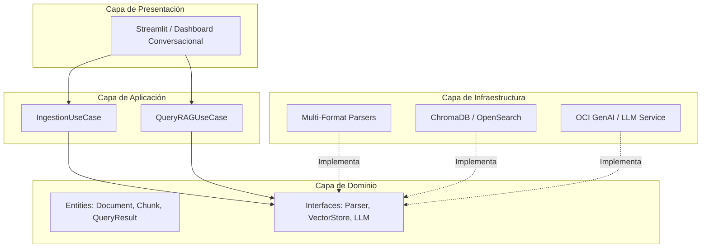

# 🤖 Agent-AI-Oracle: Agente de IA Corporativo (Desafío Alura - OCI)

[](https://www.python.org/)
[](https://www.oracle.com/cloud/)
[](https://streamlit.io/)
[](#arquitectura-del-sistema)

## 📌 Descripción del Proyecto
**Agent-AI-Oracle** es un agente de Inteligencia Artificial empresarial diseñado para responder preguntas de colaboradores de una organización con base en documentos internos multiformato. La solución implementa una arquitectura **RAG (Retrieval-Augmented Generation)** con búsqueda semántica y está containerizada para ser desplegada en **Oracle Cloud Infrastructure (OCI)**.

---

## 🎯 Capacidades Principales
- 📑 **Parsing Multiformato (8 Formatos):** PDF, Word (`.docx`), Excel (`.xlsx`), PowerPoint (`.pptx`), Markdown (`.md`), CSV, JSON e HTML.
- 🔍 **Búsqueda Semántica RAG:** Indexación de documentos con embeddings vectoriales e información de fuentes citadas.
- 🏢 **Multi-Dominio Empresarial:** Clasificación y consulta sobre RH, Finanzas, Operaciones, Legal, Estrategia, Marketing y Sistemas.
- ☁️ **OCI Cloud Native:** Despliegue listo para Oracle Cloud Infrastructure.

---

## 🏛️ Arquitectura del Sistema



---

## 🚀 Guía de Instalación y Ejecución Local

### 1. Clonar el Repositorio
```bash
git clone https://github.com/tu-usuario/Agent-AI-Oracle.git
cd Agent-AI-Oracle
```

### 2. Configurar Entorno Virtual
```bash
python -m venv .venv
# En Windows:
.venv\Scripts\activate
# En Linux/macOS:
source .venv/bin/activate
```

### 3. Instalar Dependencias
```bash
pip install -r requirements.txt
```

### 4. Variables de Entorno
Copia la plantilla de variables de entorno y ajusta tus credenciales:
```bash
cp .env.example .env
```

### 5. Ejecutar la Aplicación
```bash
streamlit run src/presentation/app.py
```

---

## 🐳 Ejecución con Docker

```bash
docker build -t agent-ai-oracle .
docker run -p 8501:8501 --env-file .env agent-ai-oracle
```

O usando Docker Compose:
```bash
docker-compose up --build
```

---

## ☁️ Despliegue en Oracle Cloud Infrastructure (OCI)
*(Sección en desarrollo - Módulo 5)*

---

## 📄 Licencia
Este proyecto es desarrollado como parte del **Desafío Alura Agentes - OCI**.
